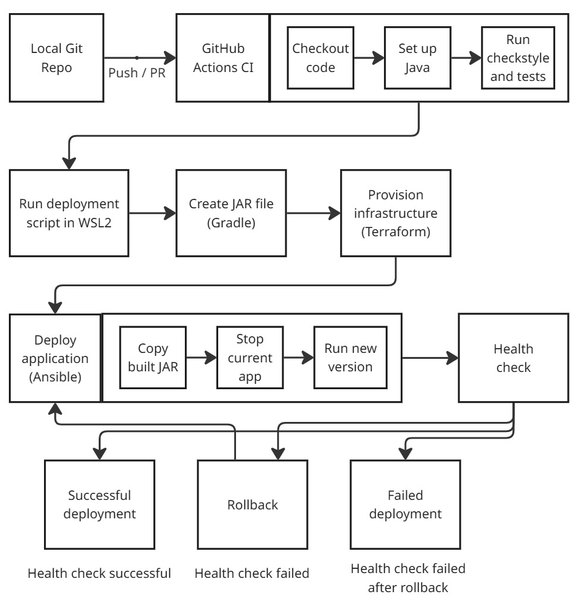

# Midterm Project


## 1. Description
This is a very simple java project build with Spring Boot with a few HTTP endpoints to set up and demonstrate a basic CI/CD pipeline.
There is a single controller with GET and POST endpoints, accepting and returning strings, and a simple test class to test the controller.


## 2. Tools
- Java 21
- Spring Boot 3.4.4
- Gradle 8.13
- GitHub Actions
- Terraform
- Ansible
- WSL2


## 3. IaC Configuration
Configuration files for the CI/CD pipeline are located in the `.github/workflows` and `config` folders. In order to run the pipeline,
certain environment variables need to be set. WSL2 should have your windows drive mounted by default, if not, please mount it beforehand
to be able to access your project files via `mnt/c/...` path. Additionally, an `.env` file should be created with path`~/midterm/.env` 
in WSL2 environment with the following content:
```bash
export PROJECT_PATH=/mnt/c/PATH_TO_PROJECT # replace with your project path to access it from WSL2
export DEPLOY_PATH=/home/YOUR_USER/midterm/deployment
export COLOR=blue
export PORT=8080
```

### 3.1. GitHub Actions
The GitHub Actions workflow is defined in the `.github/workflows/ci.yml` file. It is triggered on every push and pull request to the `main` and `dev` branches.
The workflow is simple: first it checks out the code, then it sets up Java 21, makes `gradlew` file executable, and finally it builds the project using Gradle.
Gradle itself is configured to run several tasks, including running checkstyle, tests, and building the project.

### 3.2. Terraform
Terraform is used to provision the infrastructure (separate deployment folders) on WSL2. The `main.tf` file contains the configuration for the infrastructure:
environment variable is used to set a base path for deployment, and then 3 folders are created: `green`, `blue`, and `current`. The `green` and `blue` folders are used 
for the blue-green deployment strategy, while the `current` folder is used to the pointer to the most recent running application version.
Finally, the `main.tf` file contains an additional command to remove windows-specific line endings from the created folders' names.

### 3.3. Ansible
Ansible is used to deploy the application to the provisioned infrastructure. The `deploy.yml` file is mainly responsible for copying the built jar file to the `green` or `blue` folder, 
depending on the current deployment, then stopping the currently running application, if there is any, and finally starting the new one.


## 4. CI/CD Pipeline

### CI
The CI pipeline is configured solely in the GitHub Actions workflow. It is triggered on every push and pull request to the `main` and `dev` branches.

### CD
In order to run the CD pipeline, the provided script `deploy-blue-green.sh` needs to be executed from inside the WSL2 terminal using this command:
```bash
bash $PROJECT_PATH/config/scripts/deploy-blue-green.sh
```
To toggle between deployment folders, you need to edit the `.env` file COLOR variable to `blue` or `green`.

Firstly, this script loads environment variables from the `.env` file and validates them. Then it starts the pipeline:
1. It runs `gradlew bootJar` to build the project and create a jar file without running CI steps such as checkstyle and tests.
2. It runs `init`, `validate`, `plan` and `apply` commands to provision the infrastructure using Terraform. For the last two commands, deployment path environment variable is passed to the terraform commands to choose the correct folders. The `apply` command is run with the `-auto-approve` flag to skip the confirmation prompt as well.
3. After provisioning is complete, it runs `ansible-playbook` command to deploy the application using Ansible. The `-i` flag is used to specify the inventory file, and the `--extra-vars` flag is used to pass the project path and color variables to the playbook.
4. After the deployment is complete, the script executes health check to verify that the application is running. It uses `curl` command to send a GET request to the application and checks the response code. If the response code is 200, it means the application is running successfully. If not, it prints an error message and exits with a non-zero status code. Additionally, a retry mechanism is implemented to check the health of the application every 10 seconds for a maximum of 3 attempts, as Java applications may take some time to start up.
5. If the health check is successful, it updates the `current` folder to point to the newly deployed application. It does this by creating a new symbolic link to the `green` or `blue` folder, depending on the deployment color, inside the `current` folder.
6. If the health check fails, it rolls back the deployment by removing the newly created symbolic link and restoring the previous one. It also prints an error message and exits with a non-zero status code.

All health check and application logs can be found in deployment folders. The application logs are stored in `green` and `blue` folders with name of `output.log`, while the health check logs are stored in `health-check.log` file.

## 5. Screenshots
Please refer to the `docs/SCREENSHOTS.md` file for screenshots of the pipeline execution and results.

## 6. Pipeline Diagram
