# 1. GitHub Actions CI test passed after pushing to dev branch and creating PR
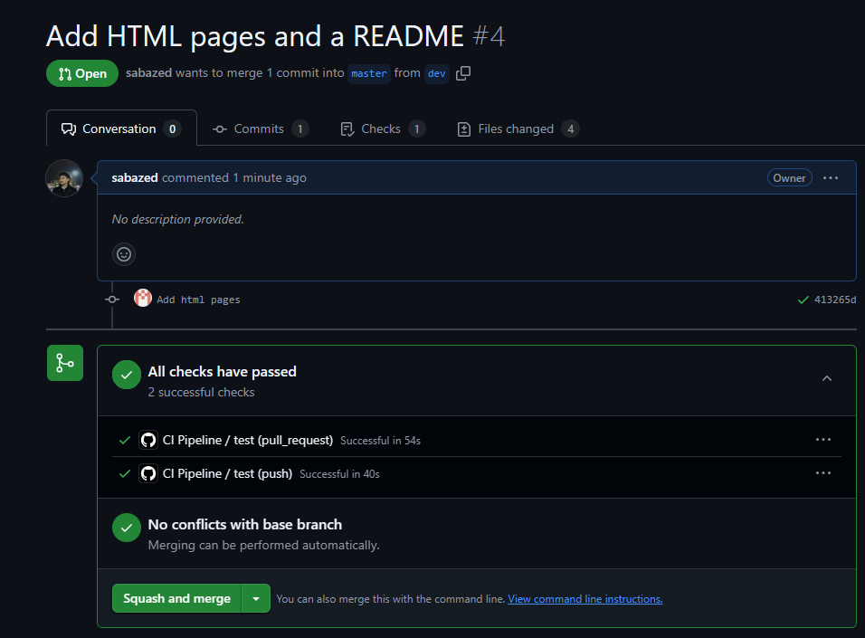

# 2. GitHub Actions CI workflow steps
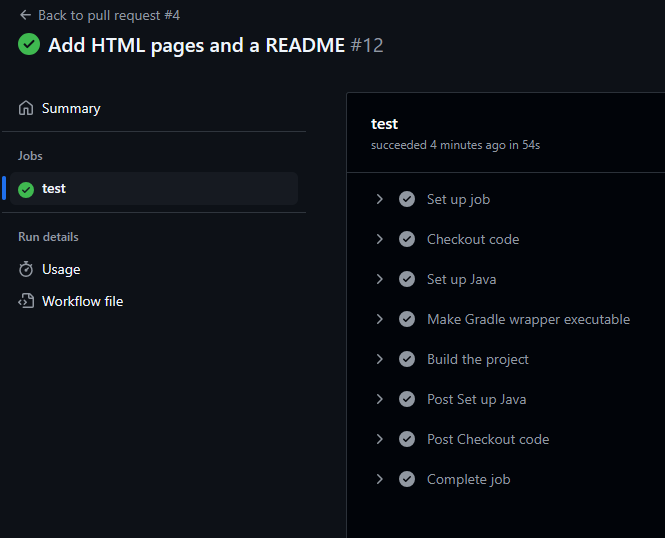

# 3. WSL2 environment
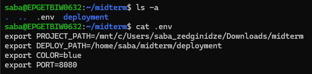

# 4. Starting the pipeline
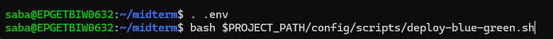

# 5. CD pipeline steps - Successful deployment
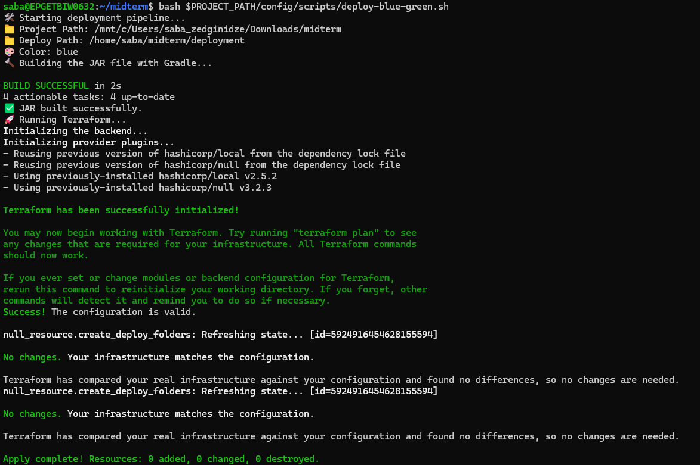
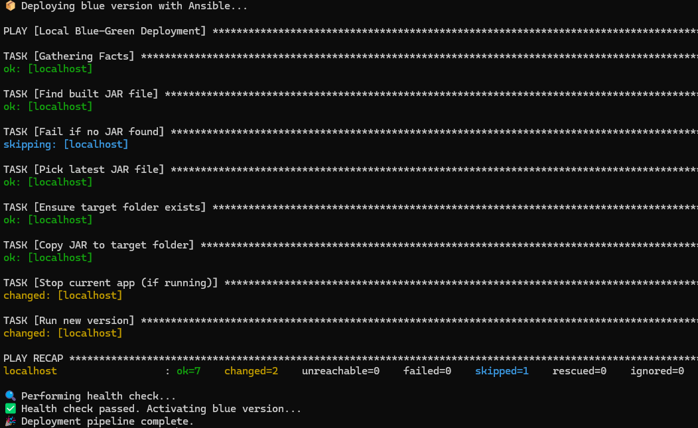

# 6. CD pipeline steps - Failed deployment
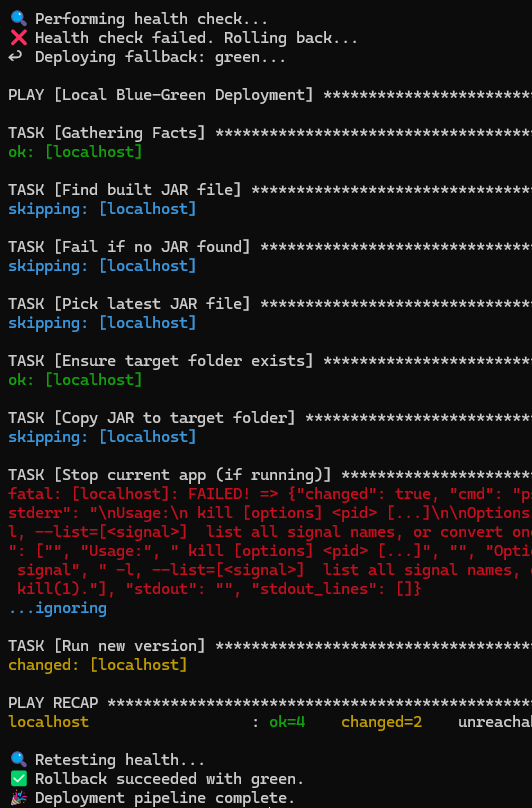

# 7. Application running
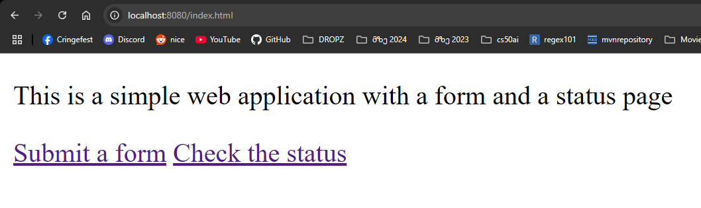
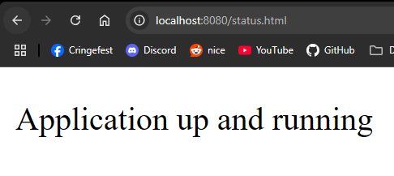
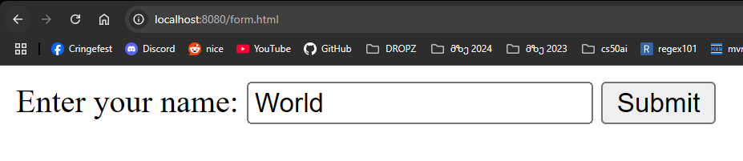
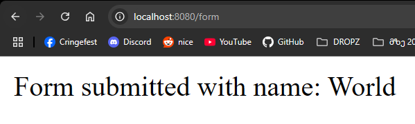